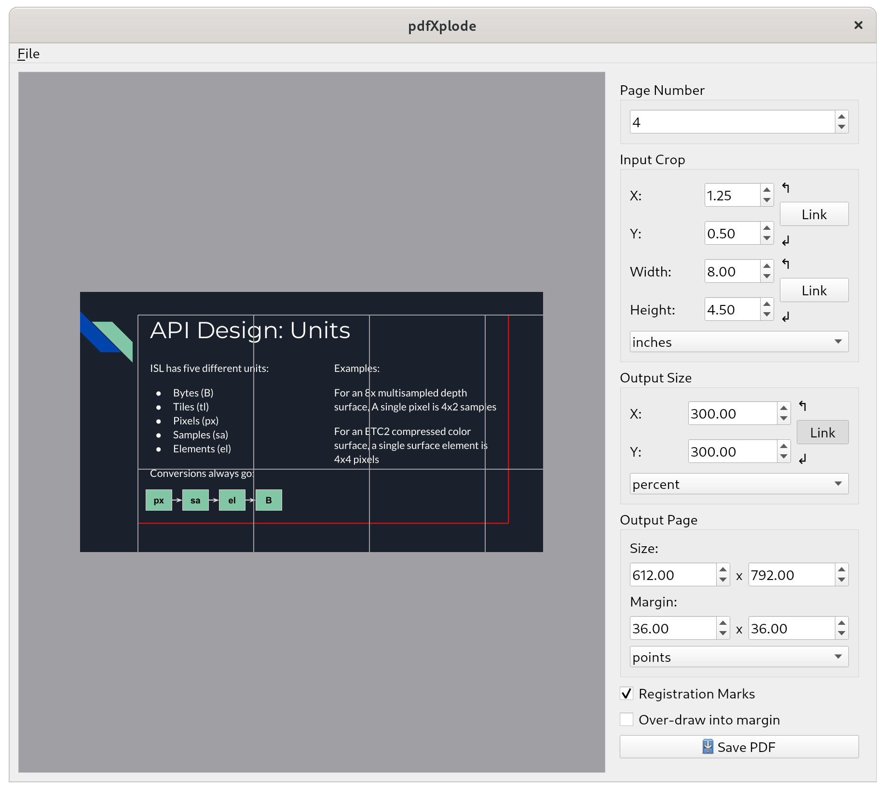

pdfXplode: A tool for blowing up PDFs and images
================================================

## About

pdfXplode is a simple tool for taking an image or a PDF, blowing it up to an
arbitrary size, and splitting it into pages that you can reasonably print on
a standard consumer printer.
